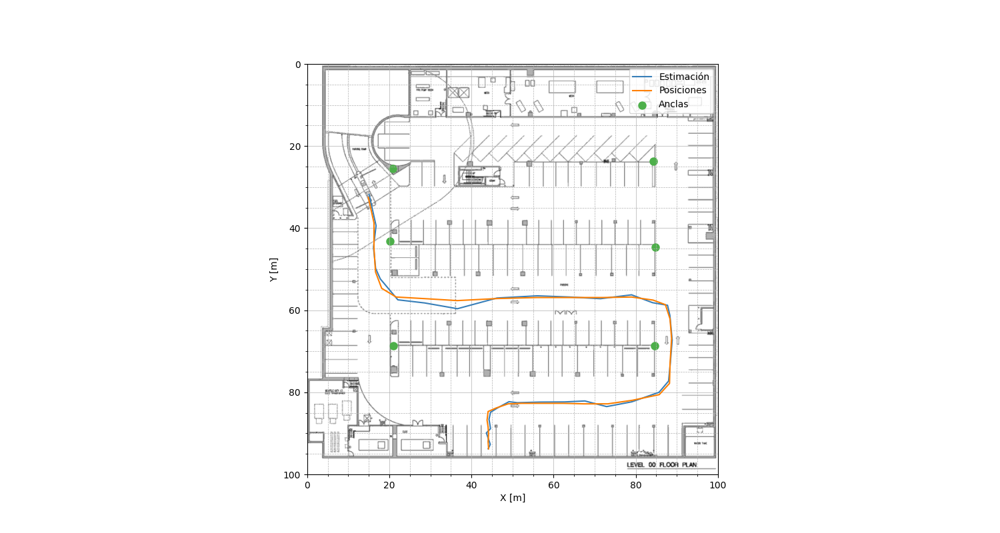

# Proyecto de Trilateración

Este proyecto implementa un algoritmo de trilateración para estimar la posición de un objetivo utilizando datos de anclas y mediciones de tiempo de llegada.

## Estructura del Proyecto

El proyecto tiene la siguiente estructura de directorios:

```bash
.
├── data
│   ├── anclas.csv
│   ├── plano.csv
│   ├── posiciones.csv
│   ├── tiempo_rx.csv
│   └── tiempo_tx.csv
├── MARCOS_DOMINGUEZ_trilatracion.py
├── readme.md
├── results
│   ├── MARCOS_DOMINGUEZ_ErrorRelativo.csv
│   ├── MARCOS_DOMINGUEZ_figura.png
│   └── MARCOS_DOMINGUEZ_resultados.csv
├── run_project.sh
└── setup_env.sh

```

- `data`: Contiene los datos necesarios para la trilateración.
- `MARCOS_DOMINGUEZ_trilatracion.py`: Archivo principal que contiene el código para ejecutar el algoritmo de trilateración.
- `results`: Directorio donde se guardan los resultados de la trilateración.
- `setup_env.sh`: Script para configurar el entorno virtual y las dependencias del proyecto.
- `run_project.sh`: Script para ejecutar el algoritmo de trilateración en el entorno virtual generado.

## Prerequisitos

- Python 3.8 o superior
- Linux OS (si se quieren usar los script para correr en el entorno virtual)

## Ejecución del Proyecto

1. Ejecutar `setup_env.sh` para configurar el entorno virtual y las dependencias:

```bash
source setup_env.sh
```

2. Ejecutar el script principal:

```bash
source run_project.sh
```

## Descripción del Algoritmo

El algoritmo implementado en el código consta de los siguientes pasos principales:

1. **Cálculo de Distancias:** La distancia entre el dispositivo y cada ancla se calcula utilizando la diferencia de tiempo entre la transmisión y la recepción de una señal acústica, multiplicada por la velocidad del sonido en el medio (aproximadamente 340 m/s).

2. **Construcción de Matrices:** Se construyen matrices y vectores necesarios para resolver la posición del dispositivo mediante el método de mínimos cuadrados. Estos incluyen la matriz de diseño (A), que contiene las diferencias en las coordenadas de las anclas, y el vector de términos independientes (b), que contiene las distancias medidas ajustadas.

3. **Resolución del Sistema:** Se resuelve el sistema de ecuaciones lineales para obtener las coordenadas del dispositivo utilizando la fórmula de mínimos cuadrados. Las coordenadas de una de las anclas se utilizan como referencia relativa.

4. **Cálculo de Posiciones:** Se obtienen las posiciones estimadas del dispositivo a partir de las coordenadas calculadas, corrigiendo con las coordenadas relativas del ancla utilizada como referencia.

5. **Evaluación del Error:** Se calcula el error absoluto y relativo entre las posiciones estimadas y las posiciones de referencia

## Resultados
Los resultados de la trilateración se encuentran en el directorio results. Los archivos generados son:

- [MARCOS_DOMINGUEZ_ErrorRelativo.csv](results/MARCOS_DOMINGUEZ_ErrorRelativo.csv): Error relativo (%) en cada muestra.
- MARCOS_DOMINGUEZ_figura.png: Imagen que muestra las posiciones original y estimada, así como las ubicaciones de las anclas.
 
 

- [MARCOS_DOMINGUEZ_resultados.csv](results/MARCOS_DOMINGUEZ_resultados.csv): Posiciones estimadas.
